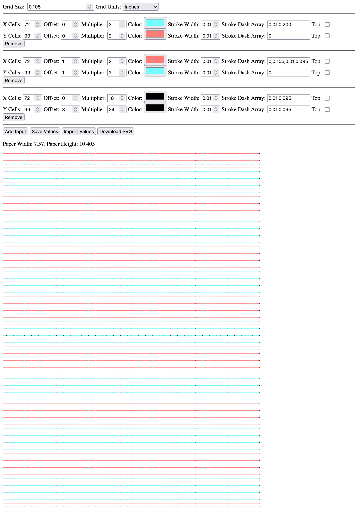

Simple script for generating grid based templates

Favorite params
?gridSize=0.105&gridUnits=in&horizontalCells=72&horizontalOffset=0&horizontalMultiplier=2&horizontalColor=%2373fdff&horizontalStrokeWidth=0.01&horizontalStrokeDashArray=0.01%2C0.200&horizontalTop=on&verticalCells=99&verticalOffset=0&verticalMultiplier=2&verticalColor=%23ff7d78&verticalStrokeWidth=0.01&verticalStrokeDashArray=0&verticalTop=on&horizontalCells=72&horizontalOffset=1&horizontalMultiplier=2&horizontalColor=%23ff7d78&horizontalStrokeWidth=0.01&horizontalStrokeDashArray=0%2C0.105%2C0.01%2C0.095&horizontalTop=on&verticalCells=99&verticalOffset=1&verticalMultiplier=2&verticalColor=%2373fdff&verticalStrokeWidth=0.01&verticalStrokeDashArray=0&verticalTop=on&horizontalCells=72&horizontalOffset=0&horizontalMultiplier=18&horizontalColor=%23000000&horizontalStrokeWidth=0.01&horizontalStrokeDashArray=0.01%2C0.095&horizontalTop=on&verticalCells=99&verticalOffset=3&verticalMultiplier=24&verticalColor=%23000000&verticalStrokeWidth=0.01&verticalStrokeDashArray=0.01%2C0.095&verticalTop=on

Afterwards
cairosvg input.svg -o cairo.pdf

Left hand pages
pdf-crop-margins -o out.pdf -p 100 -a4 -48.96 -21.42 -18 -21.42 cairo.pdf

Right hand pages
pdf-crop-margins -o out.pdf -p 100 -a4 -18 -21.42 -48.96 -21.42 cairo.pd

Middle ground

-a4 -18 -21.42 -18 -21.42